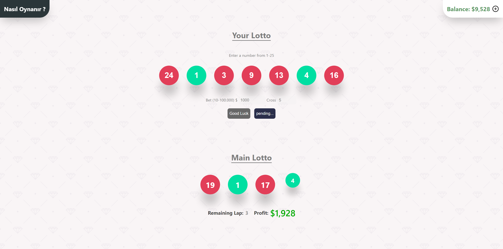

# 🎮 Try Your Luck: A Simple Lottery Game

This is a fun lottery game where users can choose numbers and see if they match the winning numbers. The game is fully responsive and works smoothly across different devices.

## Live Demo

You can try the app live by visiting [Live Demo](https://lottery-game-focuscode.vercel.app/).

## Features

- Select numbers between 1 and 25 to participate in the lottery.
- View both your selected numbers and the randomly drawn lottery numbers.
- Earn virtual cash based on how many of your numbers match the drawn numbers.
- Responsive design for an optimal experience on mobile, tablet, and desktop.

## How to Play

1. Enter your chosen numbers (1-25).
2. The lottery will draw random numbers.
3. If your numbers match the drawn numbers, you win virtual money based on the matches!

Good luck and have fun!
